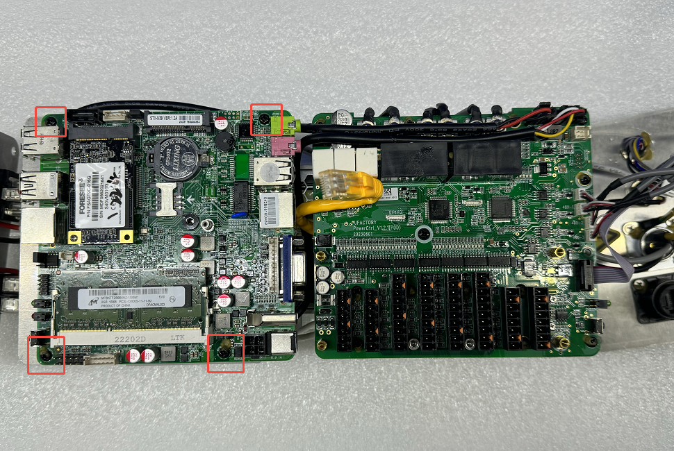
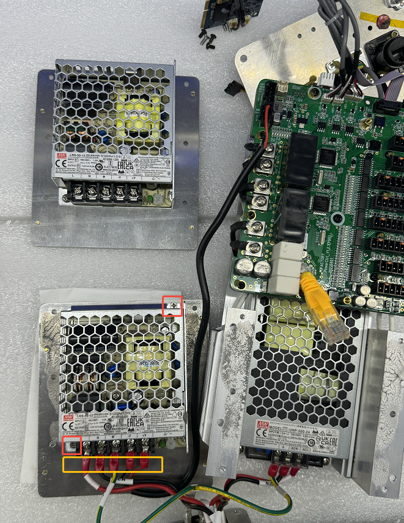

# 如何更换AC控制器的12V电源

12V电源型号：MEAN WELL LRS-50-12 

1. 请参考视频将控制器拆开。
[如何拆开AC控制器?](https://drive.google.com/drive/folders/1LiDyIoOXd-MtC4zW8miXUTSSDuxyNhir?usp=sharing)

2. 拆下1颗螺丝，将RJ45网口上的网线拔掉。

3. 拆下4颗螺丝。

4. 拆下6颗螺丝。

5. 拆下2颗螺丝，移除4根线，替换成新的12V电源。

