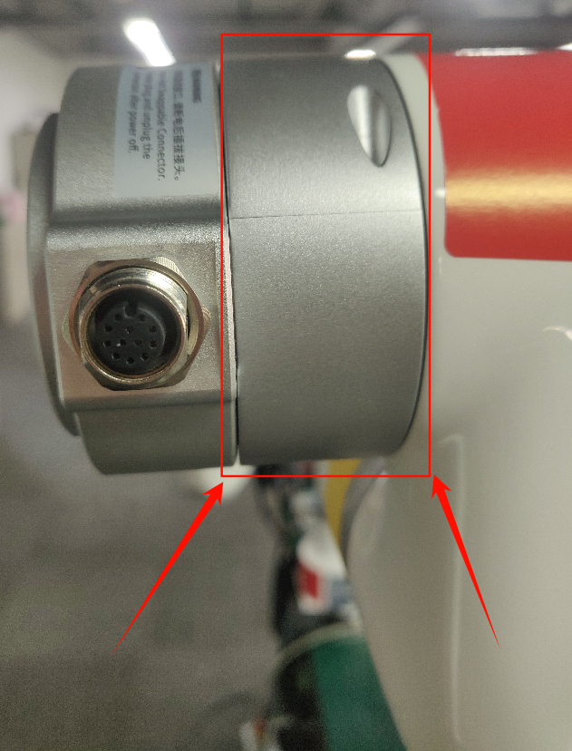
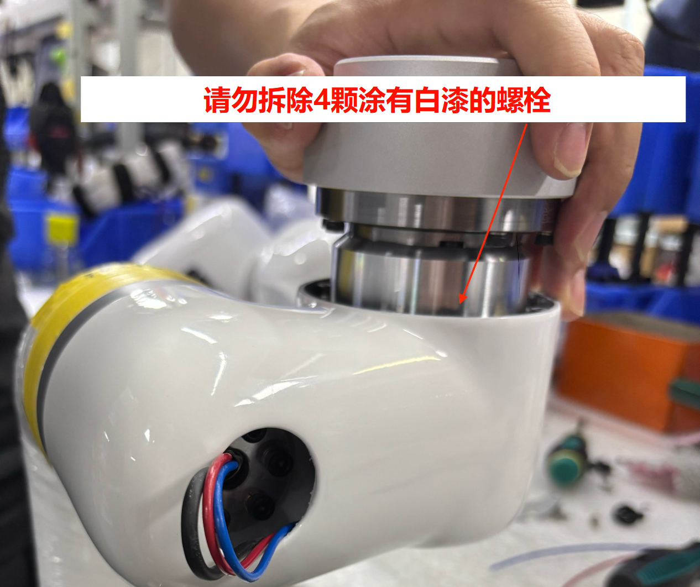
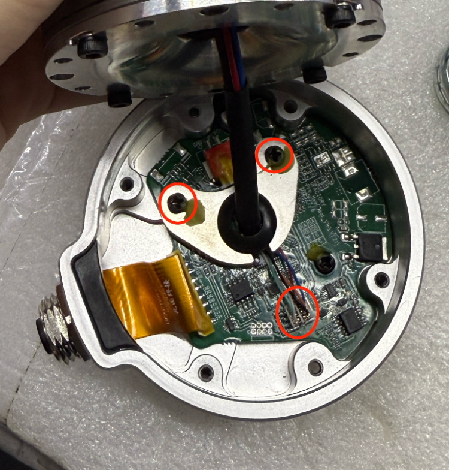
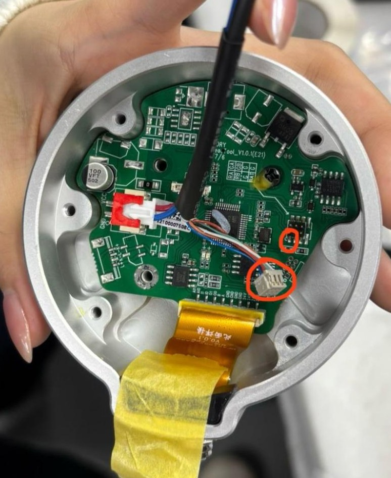
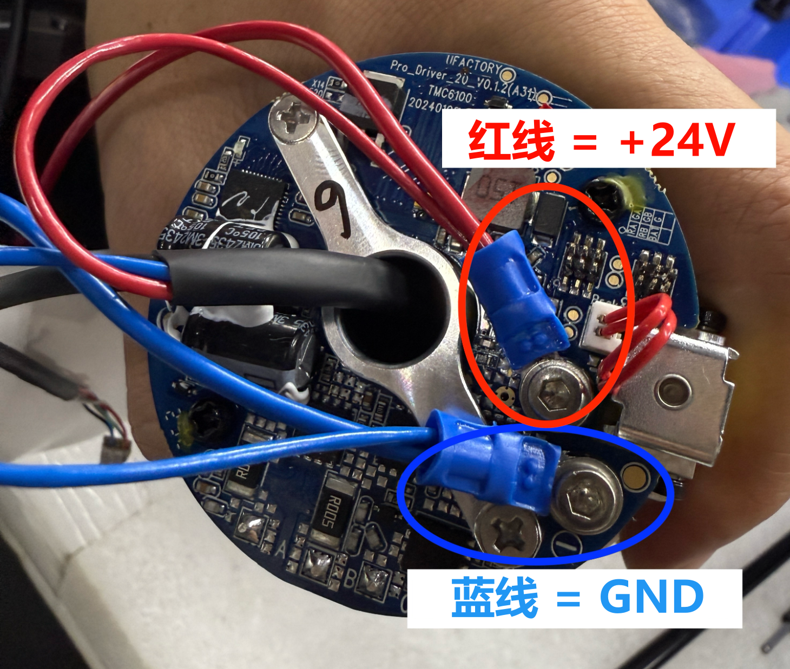
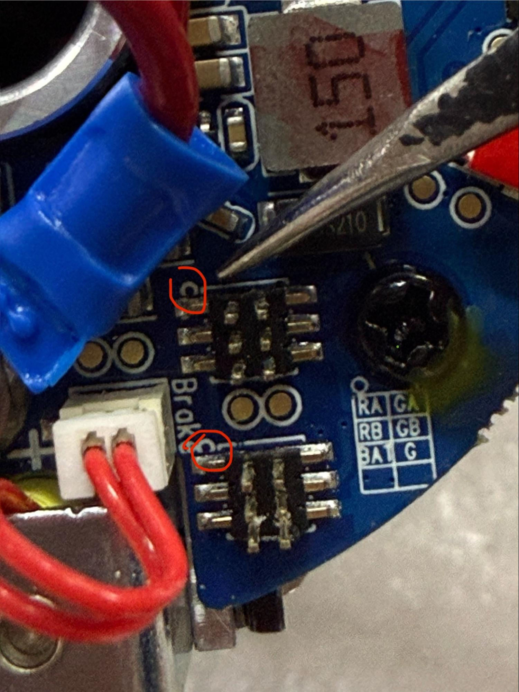
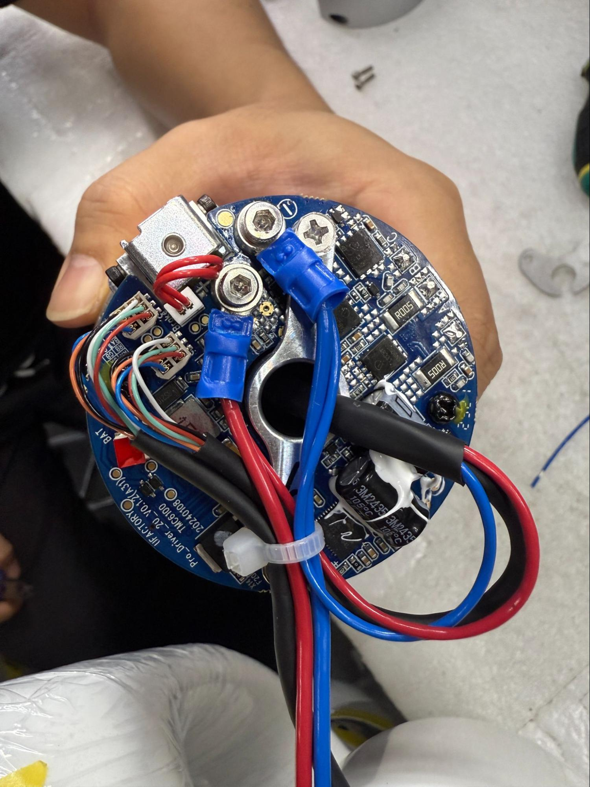
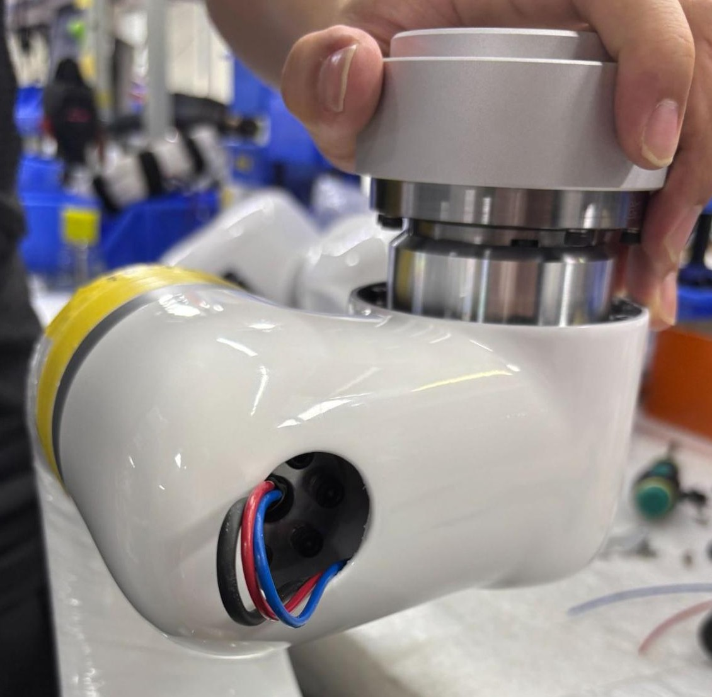

# 如何更换 xArm 1305 的末端法兰？

## 1. 先将手臂回到零点位置并且标记最后一个关节

在更换末端法兰过程中，手臂最后一个关节的零点位置会丢失并需重置。在拆卸任何部件之前，需要标记在零点位置时末端法兰 IO 接口与手臂对准位置（应与带有”UF”标志橡胶塞处于同一侧），以防此位置信息丢失。

## 2. 按下急停按钮、关闭电源并拔下手臂电源线

## 3. 拆卸手臂最后一个关节的银色护盖

护盖上的螺栓均被贴纸遮盖。可使用镊子揭开贴纸后拧下螺栓，或直接用内六角扳手戳破贴纸并拧下螺栓，然后拆下护盖

## 4. 拧下连接关节与连杆的螺栓

忽略涂有白漆的螺栓，请勿拆除涂有白漆的螺栓。拧下其他连接关节与连杆的螺栓，跳过涂有白漆的螺栓。

## 5. 断开手臂末端连接

剪断连接到红色和蓝色电线上的蓝色压线端子，拔下通信端口，若有需要，刮掉黄色胶水

## 6. 移除末端工具法兰

拧下固定法兰的螺栓，注意：两侧中间的螺栓有 3 个垫圈（2个平垫+1个弹垫），而外侧的螺栓只有1个垫圈

## 7. 注意部件的拆卸方式

拆卸部件时，注意螺栓头不得触碰金属外壳之间的电容，而应位于在槽口两侧

## 8. 断开工具法兰

拧下金属回旋镖状部件上的两颗螺栓，并拔下彩色通信线和黑色软管包裹的电源线

## 9. 连接新的工具法兰

将黑色软管包裹的电源线插入对应端子。连接彩色通信线，注意其中红线必须与电路板上的半圆标记对齐。

## 10. 固定电线

拧入金属回旋镖状部件以固定电线。在螺钉上涂上胶水

## 11. 对齐关节螺栓和工具头部

如步骤 7 所述，将螺栓头对准金属凹槽，避免碰撞到电容

## 12. 将法兰固定到关节上

在螺栓上涂上胶水，并在中间的螺栓上使用三个垫圈，在外侧的螺栓上使用一个垫圈，将法兰固定到接头。确保使用正确的较长螺栓。

## 13. 重新压接红色和蓝色电线到蓝色压线端子

红色为 +24V，蓝色为 GND。剥去约 1cm 的线皮以便压接。最佳效果是确保金属线从蓝色压线端子中露出，靠近螺栓的圆孔。将它们固定到电路板上。

## 14. 插入通讯端子

注意通信端子中的红色电线必须与电路板上的半圆标记对齐。

## 15. 正确连接后，所有部件应如下图所示

## 16. **用扎带将电线捆扎固定**

## 17. 将关节与连杆对齐

取下”UF”标志橡胶塞，在将关节与连杆对齐的同时将电线穿过。注意接口与步骤1中标记的零点位置对齐。

## 18. 用螺栓固定关节

在螺栓上轻轻涂抹胶水，并将关节螺栓固定到位。再次确认末端法兰 IO 接口与先前标记的零点位置对齐——应在带有”UF”标志橡胶塞的一侧。

## 19. 重新安装关节银色护盖前，重置最后一个关节的零点位置

进入“设置 - 通用设置 - 调参工具 - 关节”，发送以下命令：

1. `H101D0104V1I*` 解锁抱闸（`*` 代表关节ID）
2. `D13 I*` 重置零点（`*` 代表关节ID）
3. 拍下急停按钮

## 20. 重新安装关节银色护盖

使用胶水重新粘贴关节银色护盖，并拧紧螺栓固定。

