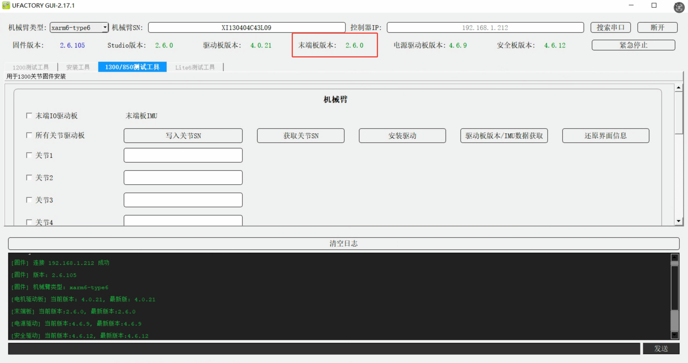
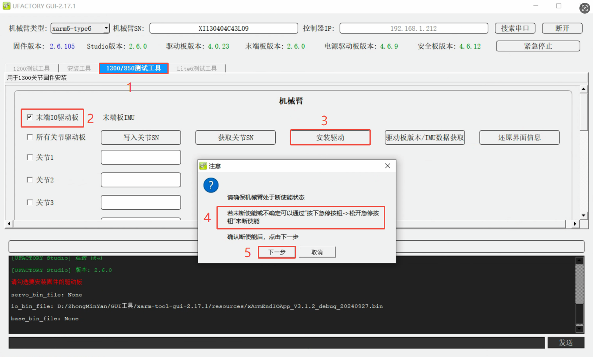
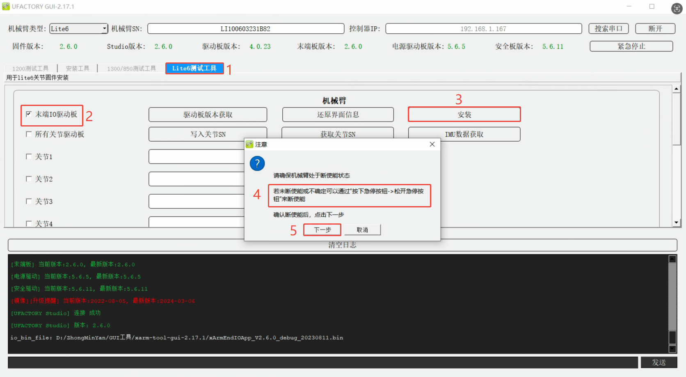

# 如何更新末端IO板固件？

## 如何查看当前末端IO板版本
运行xarm-tool-gui，输入控制器IP，点击连接，驱动板版本即可关节固件版本，如下图，驱动板版本为V2.6.0。

### 不同手臂对应关末端IO版本

| 机械臂型号                 | 末端IO板固件示例                              | 末端板版本  |
| --------------------- | -------------------------------------- | ------ |
| xArm12xx或更低版本         | io_board_app_1.2.0.bin                 | V1.2.x |
| xArm1300~1304版本或Lite6 | xArmEndIOApp_V2.6.0_debug_20230811.bin | V2.6.x |
| xArm1305版本或850        | xArmEndIOApp_V3.1.2_debug_20240927.bin     | V3.1.x |

## 如何更新末端IO版本？
1. 下载xarm-tool-gui并运行。  
Windows版本：[xarm-tool-gui-2.17.1](https://update.ufactory.cc/xarm-tool-gui-win-amd64-2.17.1.zip)  

2. 切换到对应的<u>测试工具</u>，勾选<u>末端IO驱动板</u>，点击<u>安装驱动</u>，拍下急停按钮并松开，点击<u>下一步</u>。  
* **1305或850:** 1300/850测试工具

* **Lite6:** Lite6测试工具

* **xArm12xx或更低版本:** 1200测试工具

3. 等待2-3分钟，软件提示更新成功或失败。安装成功则按下确定按钮，手臂会自动重启，等待1-2分钟后，重新连接xarm-tool-gui，使能手臂，查看关节固件版本。

