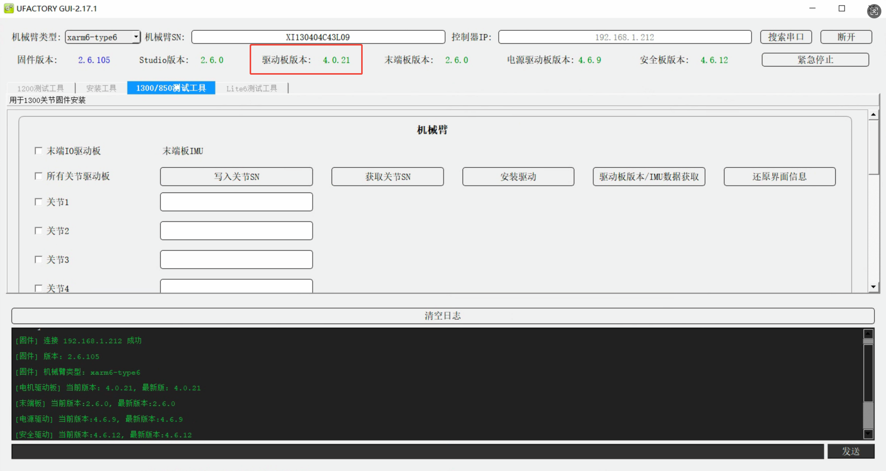
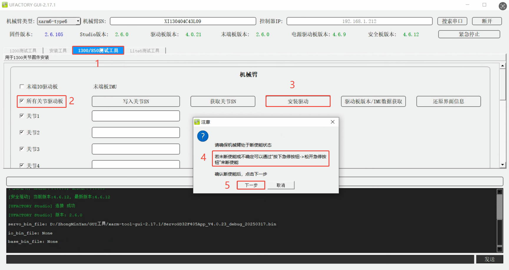
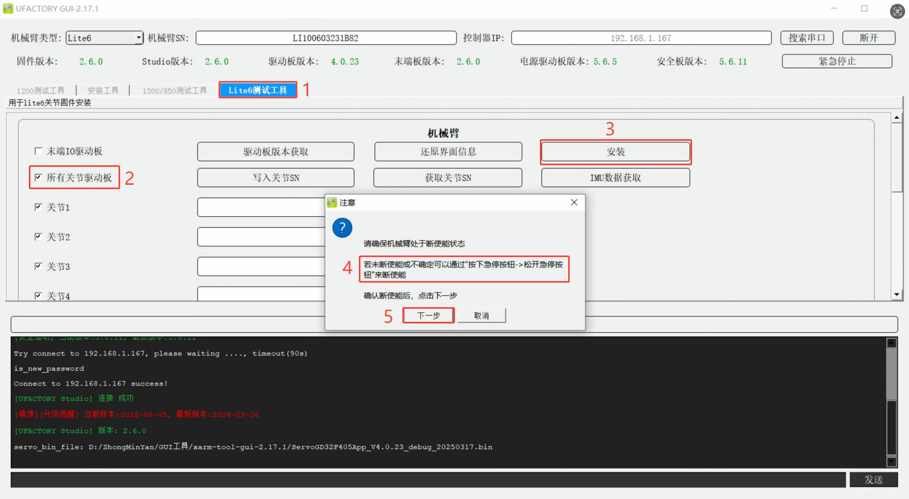
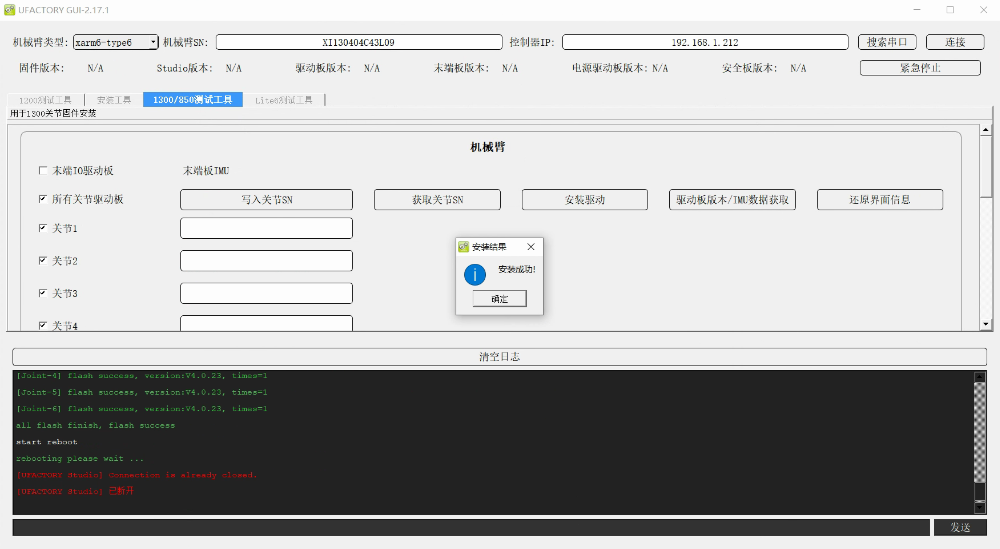

# 如何更新关节固件？

## 如何查看当前关节固件版本？
运行xarm-tool-gui，输入控制器IP，点击连接，驱动板版本即可关节固件版本，如下图，驱动板版本为V4.0.21。

### 不同手臂对应关节版本

| 机械臂型号            | 关节固件示例                                      | 关节固件版本号 |
| ---------------- | ------------------------------------------- | ------- |
| xArm1303或更低版本    | uf_servo_stm32f4xx_app_2.7.13.bin           | V2.7.x  |
| xArm1304版本或Lite6 | ServoGD32F405App_V4.0.23_debug_20250317.bin | V4.0.x  |
| xArm1305版本或850   | ServoGD32F425App_V5.0.9_debug_20241224      | V5.0.x  |

## 如何更新关节固件版本？
1. 下载xarm-tool-gui并运行。  
Windows版本：[xarm-tool-gui-2.17.1](http://update.ufactory.cc/xarm-tool-gui-win-amd64-2.17.1.zip)   

2. 切换到对应的<u>测试工具</u>，勾选<u>所有关节驱动板</u>，点击<u>安装驱动</u>，拍下急停按钮并松开，点击<u>下一步</u>。  
* **1305或850:** 1300/850测试工具

* **Lite6:** Lite6测试工具

* **xArm12xx或更低版本:** 1200测试工具

3. 等待2-3分钟，软件提示更新成功或失败。安装成功，按下<u>确定</u>按钮，手臂会自动重启，等待1-2分钟后，重新连接xarm-tool-gui，使能手臂，查看关节固件版本。
