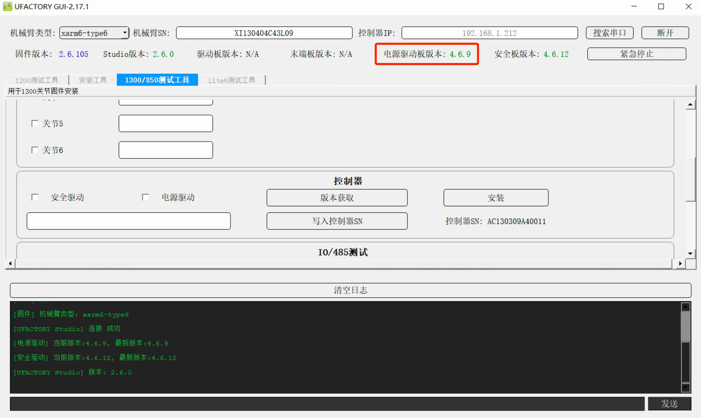
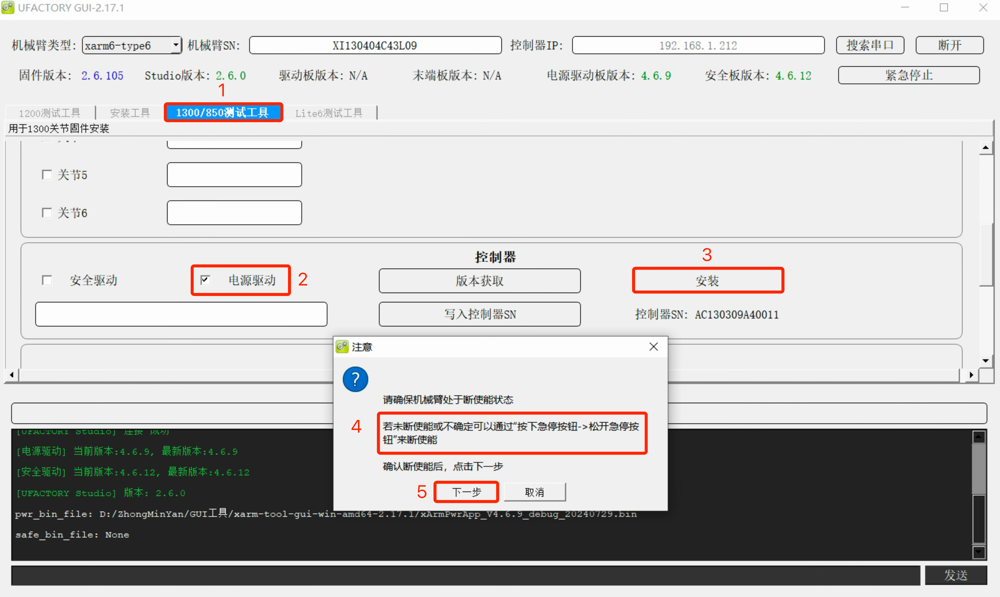

# 如何更新控制器电源板固件？

## 如何查看电源板固件？
电源板位于控制器中，和控制器相关，和机械臂无关。  

运行xarm-tool-gui，输入<u>控制器IP</u>，点击<u>连接</u>  
如下图，电源板固件版本为V4.6.9。

## 不同控制器对应电源板版本

| 机械臂型号    | 控制器型号                                  | 电源板固件示例                                | 电源板版本  |
| -------- | -------------------------------------- | -------------------------------------- | ------ |
| xArm     | AC1300~AC1302(已停产)                     | xArmPwrApp_V3.3.0_release_20210918.bin | V3.3.0 |
| xArm或850 | AC1303, AC1304, DC13xx, AC8500, DC8500 | xArmPwrApp_V4.6.9_debug_20240729.bin   | V4.6.x |
| Lite6    | DL1000                                 | xArmPwrApp_V5.6.5_debug_20230517.bin   | V5.6.x |

## 下载
[xarm-tool-gui-win-amd64-2.17.1](https://drive.google.com/drive/folders/1DlFYdzB7ARn-aMWK96mjEsWmGnob2RIk?usp=sharing)

## 升级提示

| 机械臂型号       | 控制器型号                               | 电源板版本  | 问题描述          | 升级     |
| ----------- | -------------------------------------- | ------ | ------------- | ------ |
| xArm        | AC1300~AC1302(EOF)                     | V3.3.0 | 可能会遇到C33错误    | V3.3.3 |
| xArm or 850 | AC1303, AC1304, DC13xx, AC8500, DC8500 | V4.6.5 | 可能会遇到C1，C33错误 | V4.6.9 |

## 如何更新电源板固件？
1. 连接xarm-tool-gui。
2. 切换到对应的测试工具，勾选电源驱动，点击安装。
* DL1000(Lite6) - 切换到<u>Lite6测试工具</u>
* 其他(xArm或850) - 切换到<u>1300/8500测试工具</u>
3. 手动选择对应的bin文件，拍下急停并旋起，点击下一步。

4. 等待大约15s，提示安装成功。
5. **重启控制器**，按下控制器上的红色电源按钮。
6. 重新连接xarm-tool-gui，查看电源板版本。