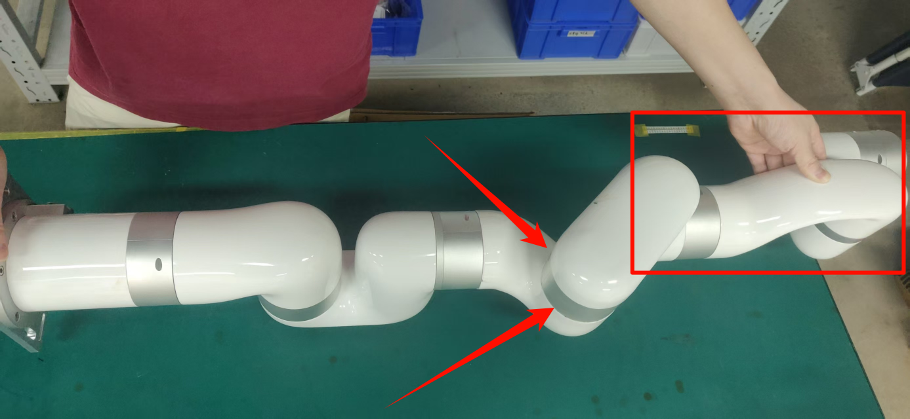

# 如何重置关节伺服零点

适用产品:XF1304 ,XI1304,XS1304,UF850

适用固件版本：2.4.0+

适用studio版本：2.4.0+

__注意：请在重置之前联系我们确认一下，否则可能会影响保修__

## 前提准备

### xArm5/xArm6——关节3

1. 移除所有末端负载，把TCP负载设置为0

2. 把手臂平放在水平桌面上，如下图所示，把 J3 转到大概-175°，确保J4 J5 J6是悬空的，然后用手扶着机械臂，保证机械臂保持不动。

### UF850——关节4

1. 移除所有末端负载，并把TCP负载设置为0

2. 确保手臂回到零点位置

### xArm7——关节4

1. 移除所有末端负载，并把TCP负载设置为0

2. 把手臂平放在水平桌面上，如下图所示，把 J4 转到大概175°，确保J5 J6 J7是悬空的，然后用手扶着机械臂，保证机械臂保持不动。

## 重置命令

1. 按下急停再松开

2. __不要使能机械臂__，在设置—通用设置—调参工具—关节界面下方，发送重置伺服零点指令(指令请联系技术支持support@ufactory.cc)，之后J\*会轻微转动，你将会听到咔哒声，然后关节不动了，这表明重置结束。

3. 重复执行一遍步骤2，即可完成重新设置伺服零点
4. 重启整个系统，然后使能机械臂

5. 进入studio的设置—通用设置—调参工具—关节界面，解锁关节 * ，然后把关节 * 移动到原始零点，发送`D13 I*`，按下急停再松开使得指令生效，这将使关节J*设置到0°
