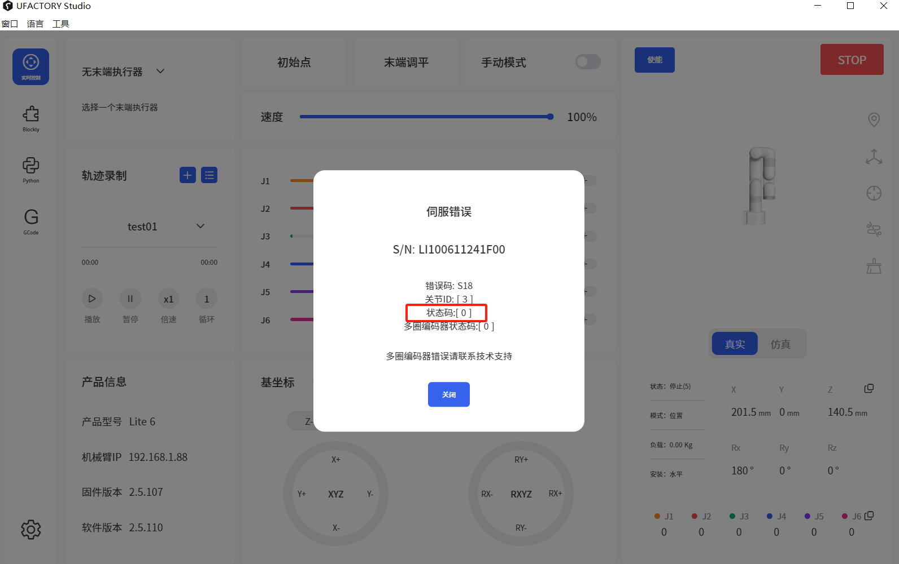
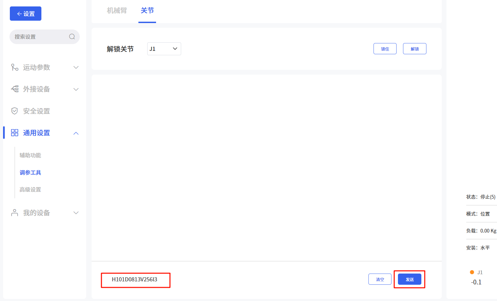

# 如何解决S18错误

S18：多圈编码器错误

适用产品：xArm系列, UF 850, Lite6

适用固件版本：V2.4.0+

适用studio版本：V2.4.0+

1. 长时间不使用机械臂（≥3 个月），则需要每 3 个月打开机械臂电源 6 小时，为机械臂的内置电池充电，否则编码器数据可能丢失并报告S18问题。
2. 物流运输后，编码器可能会震荡，导致S18问题。

### 状态码=0或状态码=8:

* 进入 “设置-通用设置-调试工具-关节”；
* 输入**H101D0813V256I\***，并发送；
* 按下急停按钮，**等待10秒后**松开急停。  

（*代表关节ID，范围是1~7）
例如：H101D0813V256I3

## 状态码不为0或8

请提供机械臂的SN和错误弹窗截图给我们.
