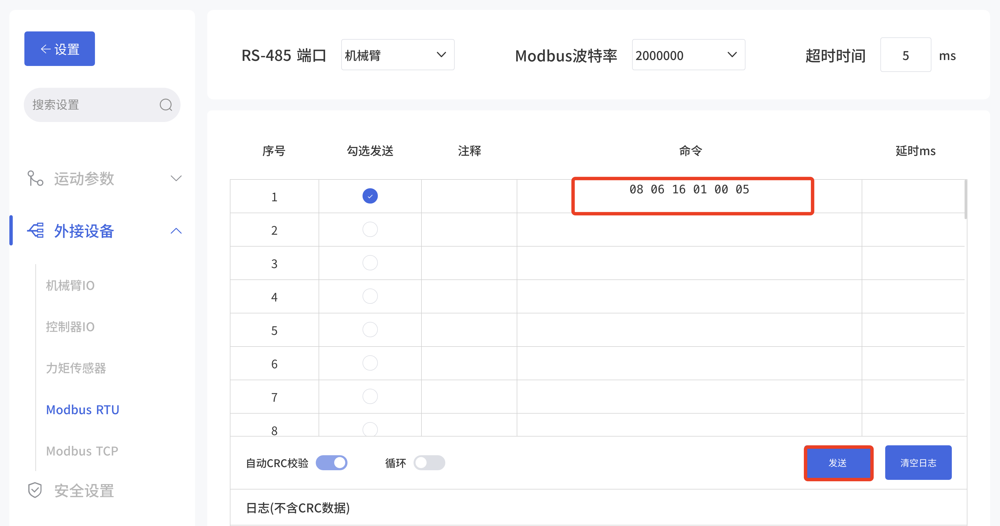
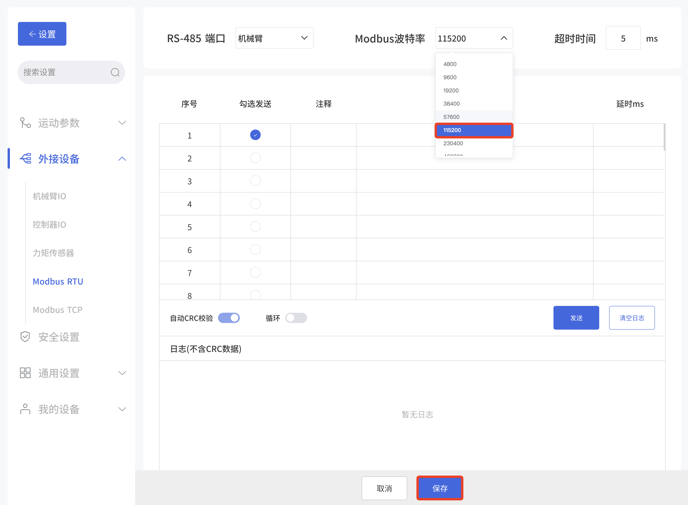
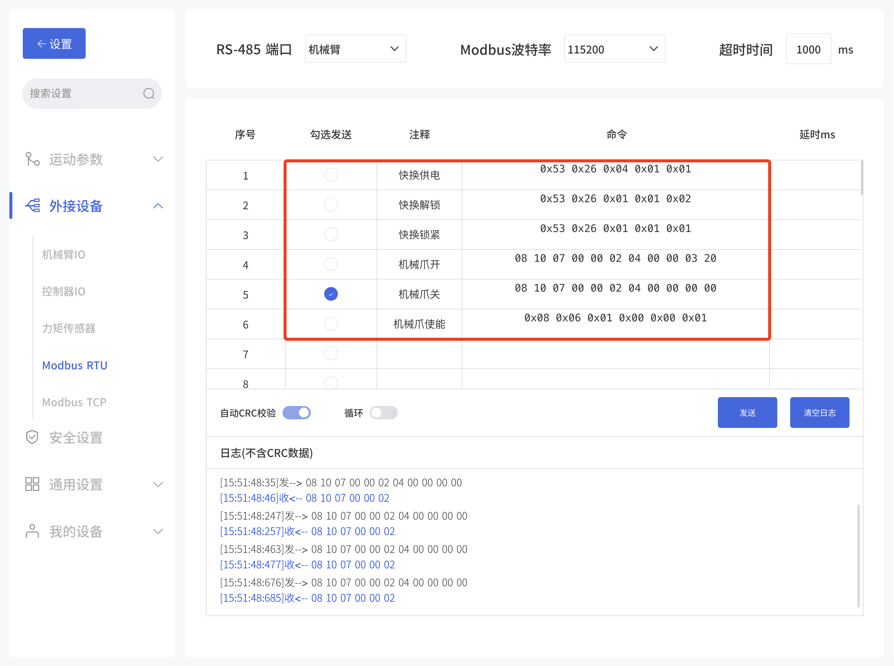
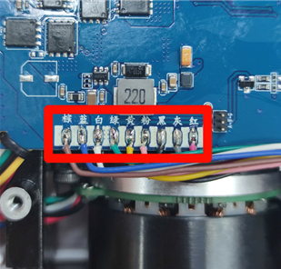
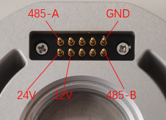

# 如何在xArm上使用xArm Gripper和Quick Link快换头

* **xArm Gripper** ：[使用手册](https://docs.accessories.ufactory.cc/zhHans/xArm_Gripper/1.Introduction.html)
* **Quick Link快换头** ：[使用手册](https://alidocs.dingtalk.com/i/p/NE0VzgAErrZmJepPRBGvao8R51nagmDA)

Quick Link安装在xArm机械臂末端，xArm机械爪连接Quick Link快换头，需要注意：
* 线缆连接正确
* 波特率一致

## 1. 修改xArm机械爪波特率
xArm机械臂默认波特率为2000000， Quick Link快换头默认波特率为115200, 需要确保波特率一致，将xArm机械爪波特率修改为115200。  

修改步骤：
1. 将xArm机械爪安装在xArm末端，确保可以正常控制，可以在Studio实时控制界面进行一次简单开合。
2. 进入设置-外接设备-Modbus RTU，发送修改指令： `08 06 16 01 00 05`。
3. 拍下控制器上的急停按钮，并松开，波特率修改生效。

（05对应115200，0B对应2000000）
| 波特率对应关系 |           |     |            |
| ------- | --------- | --- | ---------- |
| 0       | 4800bps   | 7   | 460800bps  |
| 1       | 9600bps   | 8   | 921600bps  |
| 2       | 19200bps  | 9   | 1000000bps |
| 3       | 38400bps  | 10  | 1500000bps |
| 4       | 57600bps  | 11  | 2000000bps |
| 5       | 115200bps | 12  | 2500000bps |
| 6       | 230400bps |     |            |

4. 验证波特率是否修改成功。进入设置-外接设备-Modbus RTU界面，将机械臂末端波特率修改为115200并保存。进入实时控制界面，验证是否可以正常可和机械爪。

## 2. 硬件连接
**机械爪使用接口定义：**   
两组24V和GND都要接上。
| 颜色  | 信号       | 颜色  | 信号      |
| --- | -------- | --- | ------- |
| 棕   | +24V（电源） | 白   | 0V（GND） |
| 蓝   | +24V（电源） | 绿   | 0V（GND） |
| 粉   | 用户485-A  | 黄   | 用户485-B |

**Quick Link快换头定义：**

## 3. 软件控制
* 进入设置-外界设备-Modbus RTU，将波特率设置为115200，超时时间设置为1000ms,点击保存。
* 快换头供电
* 快换头锁定（这里超时时间需要设置1000ms，快换头回复时间长）
* 使能机械爪
* 控制机械爪

| 操作名称                 | 样例指令                                                       | 返回指令                     |
| -------------------- | ---------------------------------------------------------- | ------------------------ |
| 快换-控制24V/12vadj供电/断电 | 0x53 0x26 0x04 0x01 0x01 CRC                               | 53 26 04 01 01 2A D5 CRC |
| 快换-锁紧                | 0x53 0x26 0x01 0x01 0x01 CRC                               | 53 26 01 01 01 CRC       |
| xArm机械爪-使能           | 0x08 0x06 0x01 0x00 0x00 0x01 CRC                          | 08 06 01 00 00 01 CRC    |
| xArm机械爪-张开到800       | 0x08 0x10 0x07 0x00 0x00 0x02 0x04 0x00 0x00 0x03 0x20 CRC | 08 10 07 00 00 02 CRC    |
| xAmr机械爪-闭合到0         | 0x08 0x10 0x07 0x00 0x00 0x02 0x04 0x00 0x00 0x00 0x00 CRC | 08 10 07 00 00 02 CRC    |

## 如何确认硬件连接正确？
拆开机械爪外壳6颗螺丝，用万用表测量触点和爪子PCB的通断。  
机械爪： 棕蓝24V+，白绿GND，粉色485A，黄色485B。

