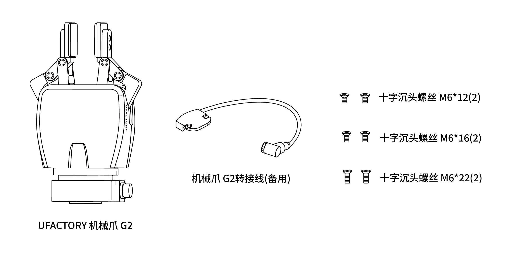
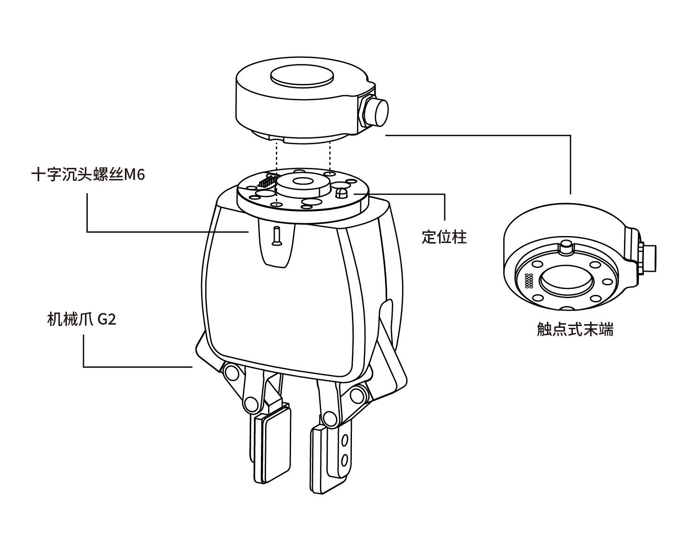
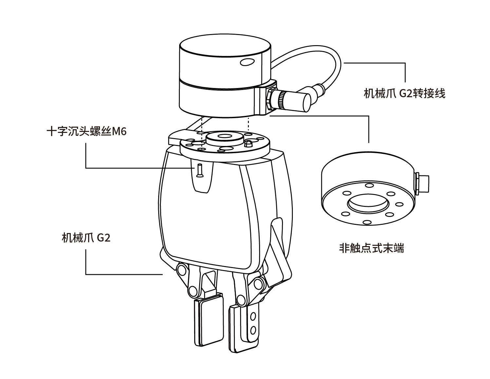
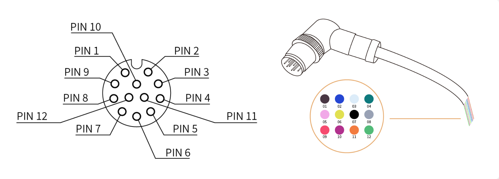

# 2.安装

**警告**

安装之前：
* 阅读并理解与机械爪G2有关的安全说明。
* 根据发货清单和订单验证包裹。
* 备有需求中列出的所需零件。  

安装时：
* 满足环境条件。
* 在牢固地固定住机械爪并清除危险区域之前，请勿操作机械爪或打开电源。
机械爪的手指可能会移动并造成伤害或损坏。

## 2.1. 发货清单

机械爪G2套件通常包括以下物品（如下图所示）：
* UFACTORY机械爪G2（1个）
* 机械爪G2转接线（备用）
* 十字沉头螺丝M6*12（2个）
* 十字沉头螺丝M6*16（2个）
* 十字沉头螺丝M6*22（2个）

## 2.2.机械安装

### 2.2.1 安装准备
1. 使机械臂运动到安全位置（避免碰到机械臂安装表面或者其他设备）；
2. 机械臂断电（按下控制器急停按钮）；

### 2.2.2 安装

* 若手臂末端是触点式：（UF850,XX1305）
用2颗M6螺丝把机械爪固定在机械臂末端；

* 若手臂末端不是触点式：（XX1304或以下）
1. 请将机械爪G2法兰面两颗螺丝拧开，取下黑色盖板，替换银色盖板和机械爪G2转接线；

2. 用2颗M6螺丝把机械爪G2固定在机械臂末端；
3. 连接机械臂G2转接线到机械臂末端；

**注意：**
1. 安装机械爪G2时一定要使机械臂断电，急停开关处于按下状态，机械臂电源指示灯熄灭，避免热插拔引起机械臂故障。
2. 机械爪G2和机械臂接通时注意务必对齐两端接口的定位孔，机械爪G2连接线的公针较为纤细，避免在拆装时使公针弯曲。

## 2.3.电气设置

### 2.3.1 触点式接口
触点式接口定义：

机械爪G2使用的信号有：两个24V，两个GND，T_A，T_B。

### 2.3.2.航插接口
机械爪G2航插接口如下图所示。

电缆内部的12条线有不同颜色，不同颜色代表不同功能，请参见下表：

| 线序 | 颜色   | 信号               |
|------|--------|--------------------|
| 1    | 棕     | +24V（电源）       |
| 2    | 蓝     | +24V（电源）       |
| 3    | 白     | 0V （GND）         |
| 4    | 绿     | 0V （GND）         |
| 5    | 粉     | 用户485-A          |
| 6    | 黄     | 用户485-B          |
| 7    | 黑     | 工具输出 0 （TO0）  |
| 8    | 灰     | 工具输出 1 （TO1）  |
| 9    | 红     | 工具输入 0 （TI0）  |
| 10   | 紫     | 工具输入 1 （TI1）  |
| 11   | 橙     | 模拟输入 0 （AI0）  |
| 12   | 浅绿   | 模拟输入 1 （AI1）  |

机械爪G2使用的信号有：24V（PIN1和PIN2），GND（PIN3和PIN4），485A（PIN5），485B（PIN6）。
