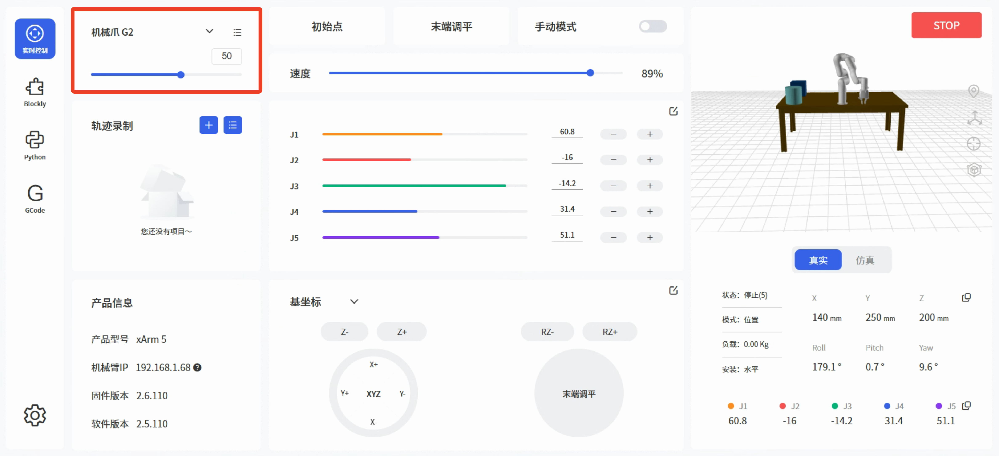
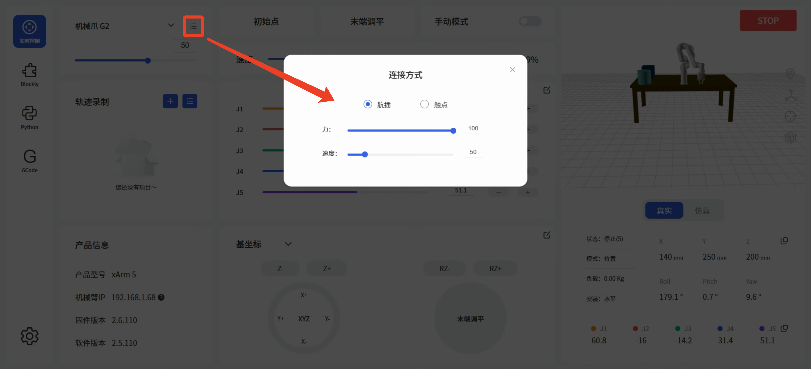
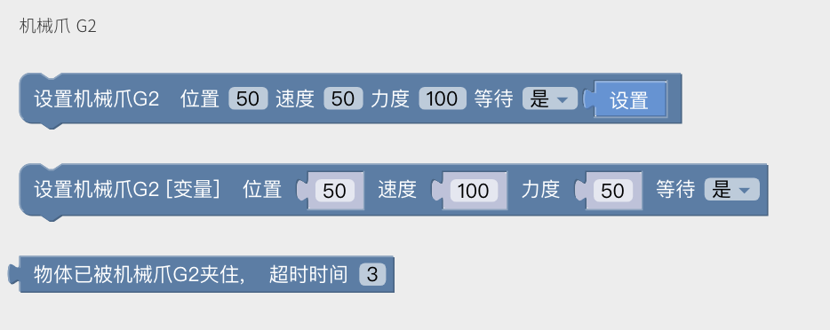
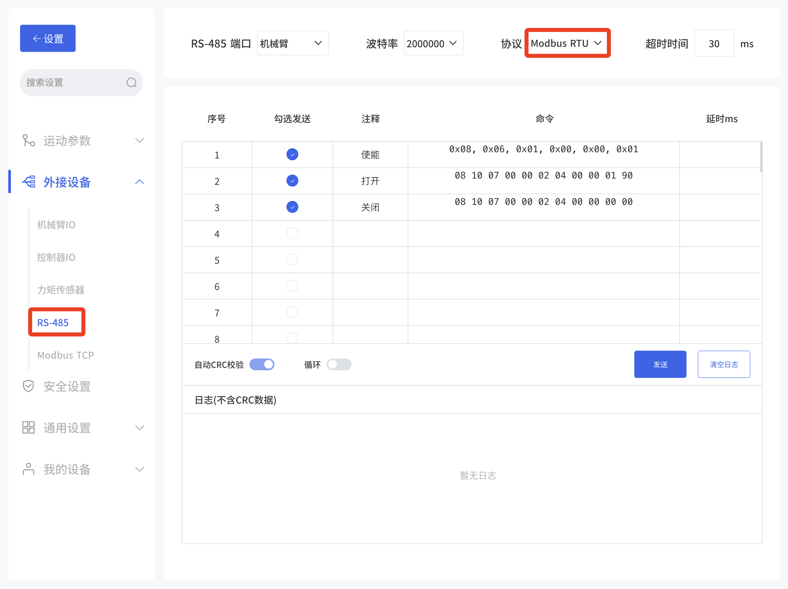
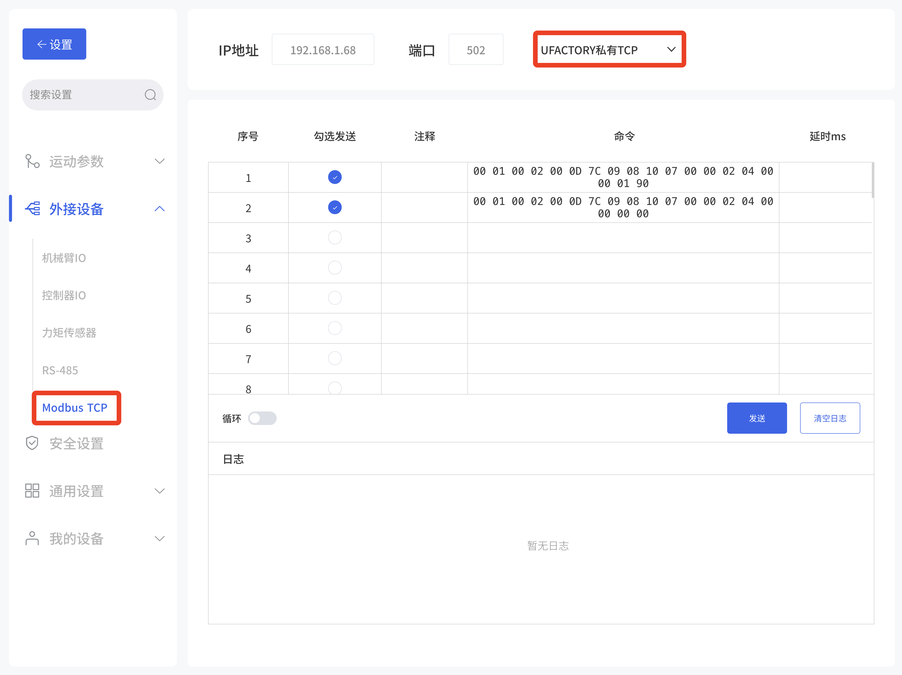

# 3.控制方式
## 3.1.用UFACTORY Studio控制

### 3.1.1 实时控制界面控制
进入实时控制界面，选择机械爪G2，可进行位置控制，范围0-84。
点击右上角按钮，可选择连接方式，调整开合力和速度。



### 3.1.2 Blockly控制
Blockly为机械爪G2提供3个块，如下：
* 设置机械爪G2 位置[] 速度[] 力度[] 等待[]
* 设置机械爪G2[变量] 位置[] 速度[] 力度[] 等待[]
* 物体已被机械爪G2夹住 超时时间[]



### 3.1.3 Modbus RTU控制
进入设置-外接设备-RS485页面，选择Modbus RTU协议，发送相应的指令进行控制。   
Modbus通讯协议请参考 第四章Modbus RTU通讯协议。


### 3.1.4 UFACTORY私有协议控制
进入设置-外接设备-Modbus TCP页面，选择'UFACTORY私有TCP'，发送相应的私有TCP指令进行控制。  
UFACTORY私有协议请参考 附录。



## 3.2 用Python SDK控制

常用接口如下：(Python SDK ≥ 1.16.0)
`set_gripper_g2_position`：设置机械爪G2的位置、力、速度；
`get_gripper_g2_position`：获取机械爪G2位置。  

Python示例：
```python

import os
import sys

sys.path.append(os.path.join(os.path.dirname(__file__), '../../..'))

from xarm.wrapper import XArmAPI

arm = XArmAPI('192.168.1.68')
arm.motion_enable(enable=True)
arm.set_mode(0)
arm.set_state(state=0)

code = arm.set_gripper_enable(True)
print('set gripper enable, code={}'.format(code))

code = arm.set_gripper_g2_position(80, wait=True, speed=200, force=80)
print('set gripper, code={}'.format(code))

print('position=', arm.get_gripper_g2_position())
```