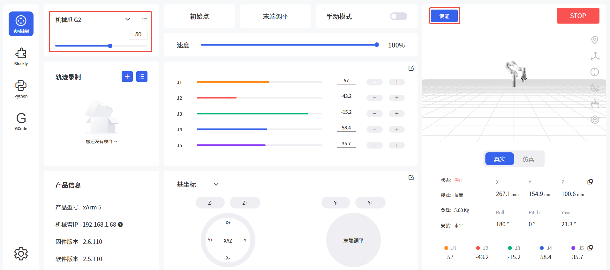

# 5. 报警与处理

## 5.1 错误代码

| **软件报错代码** | **报警代码** | **报警处理**                                          |
| ---------- | -------- | ------------------------------------------------- |
| G9         | 0x09     | 机械爪电流检测异常 请通过控制器上的紧急停止按钮重启机械臂                     |
| G11        | 0x0B     | 机械爪电流过大 请点击“确认”重新使能机械爪                            |
| G12        | 0x0C     | 机械爪速度过大 请点击“确认”重新使能机械爪                            |
| G14        | 0x0E     | 机械爪位置指令过大 请点击“确认”重新使能机械爪                          |
| G15        | 0x0F     | 机械爪EEPROM读写错误 请点击“确认”重新使能机械爪                      |
| G20        | 0x14     | 机械爪驱动IC硬件异常 请点击“确认”重新使能机械爪                        |
| G21        | 0x15     | 机械爪驱动IC初始化异常 请点击“确认”重新使能机械爪                       |
| G23        | 0x17     | 机械爪电机位置偏差过大 请检查机械爪运动是否受阻，如机械爪运动未受阻，请点击“确认”重新使能机械爪 |
| G25        | 0x19     | 机械爪指令超软件限位 请检测机械爪指令是否设置超出软件限制                     |
| G26        | 0x1A     | 机械爪反馈位置超限软件限位                                     |
| G33        | 0x21     | 机械爪驱动器过载                                          |
| G34        | 0x22     | 机械爪电机过载                                           |
| G36        | 0x24     | 机械爪驱动器类型错误 请点击“确认”重新使能机械爪                         |

上表中未出现的报警代码：重新使能机械臂和机械爪。如频繁出现，请联系技术支持

## 5.2 报警处理

### 5.2.1 通过UFACTORY Studio清除错误

1. 通过控制器上的紧急停止按钮重新对机械臂上电 
2. 使能机械臂：点击报错弹窗的引导按钮或者首页的使能机械臂按钮。
3. 选择机械爪G2，并进行控制。


### 5.2.2 通过xArm-Python-SDK清理错误


清除错误步骤：([Python-SDK接口](https://github.com/xArm-Developer/xArm-Python-SDK/blob/master/doc/api/xarm_api.md))

1. 通过控制器上的紧急停止按钮重新对机械臂上电 
2. 清除错误：`clean_error()`  
3. 重新使能机械臂：`motion_enable(enable=True)`  
4. 设置运动模式：`set_mode(0)`
5. 设置运动状态：`set_state(0)`
6. 使能机械爪G2: `set_gripper_enable(enable=True)`

python示例：
```python
import os
import sys
import time

sys.path.append(os.path.join(os.path.dirname(__file__), '../../..'))

from xarm.wrapper import XArmAPI

arm = XArmAPI('192.168.1.68')
arm.clean_error() #清除错误
arm.motion_enable(enable=True) #重新使能机械臂
arm.set_mode(0) #设置运动模式
arm.set_state(0) #设置运动状态
arm.set_gripper_enable(True)  #使能机械爪G2

```

