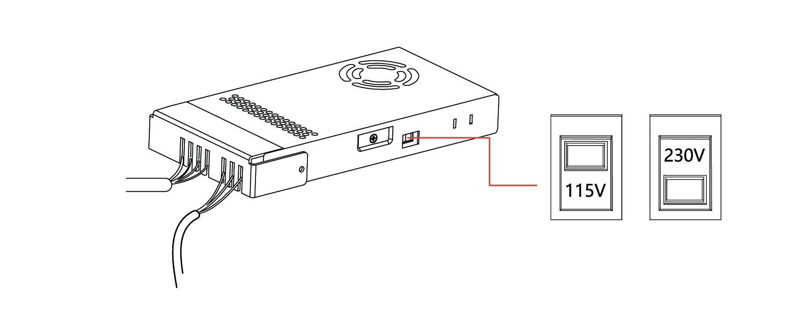
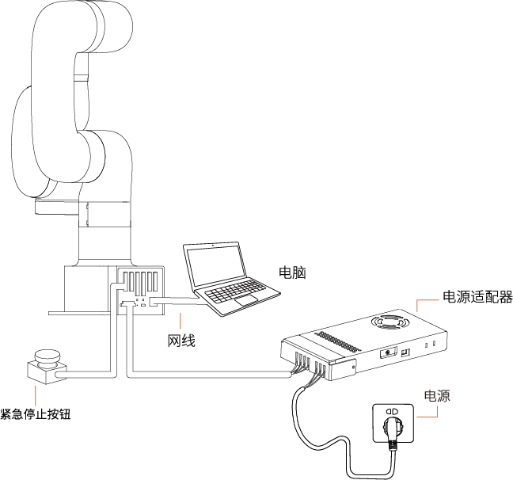
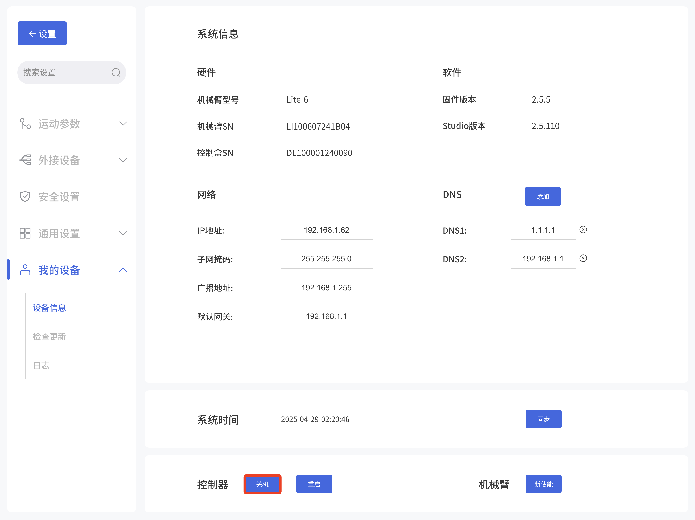
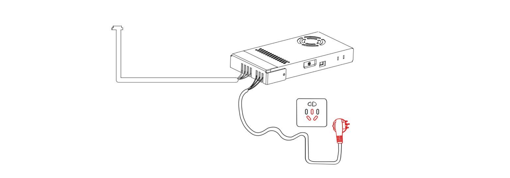

# 2. 硬件组成

## 2.1.1 硬件组成
 机械臂由底座和旋转关节组成，每个关节表示一个自由度，从底座往上依次表示关节1、关节2、关节3...。最后一个关节也叫工具端，用于连接末端执行器（机械爪，真空吸头等）。

## 2.2 Lite6安装

## 2.2.1 安装说明
**危险**  
* 确保机器人正确并安全地安装到位。安装表面必须是防震坚固的。
* 安装机器人必须检查螺栓是否拧紧。
* 将机械臂安装在一个坚固的表面，该表面应当足以承受至少 10 倍的机座关节的完全扭转力，以及至少 5 倍的机械臂的重量。

**警告** 
* 机器人切勿直接触碰液体，不应长期放置在潮湿环境。
* 每次安装完都需要进行安全评估。在连接、断开机器人电缆时，确保已断开外部交流电的连接。切勿在连接了外部交流电的情况下去连接或者断开机器人电缆，以免触电发生危险。  

### 2.2.2 确定工作空间
机械臂工作空间是指在关节延伸范围内的区域。下图为机械臂的尺寸图和工作范围图。在安装时，务必考虑机械臂的运动范围，以免磕碰到周围人员和设备（以下工作范围不包括末端执行器）。  

* Lite6工作空间，单位：mm

### 2.2.3 安装机械臂
#### 2.2.3.1 固定机械臂
机械臂使用4颗M5螺栓，通过机械臂基座上的4个Ф5.5孔用安装工具夹来安装机械臂。建议以 20Nm 扭矩紧固这些螺栓。  
使用G字架或其他工具固定机械臂。

#### 2.2.3.2 连接电源适配器
1. 将机械臂电源适配器接头插入机械臂接口，接头具备防呆功能（每个接头都具有固定卡槽，请对准后再进行接线），已做限位处理，请勿暴力拆装；
2. 检查电源适配器侧面的电压选择开关（230V/115V）,请将电源挡位调整到符合匹配当地的电压，例如：当地220V电压则对应选择230V电压挡位，当地110V电压则对应选择115V电压挡位，**请勿错误选择电压挡位**，然后再将电源适配器插入插座插口；

#### 2.2.3.3 Lite6连网
将网线接头插入底座标为LAN的接口，网线另一端接头插入PC端（电脑）的网口或者局域网网口。

## 2.3 机械臂系统上电

上电前准备：
* 检查机械臂的电源电缆是否连接完好。
* 检查网络电缆是否连接完好。
* 确保机械臂在工作范围内不会碰到周围人员或设备。

### 2.5.1 系统上电

1. 连接电源适配器。
2. 检查状态指示灯是否亮起，若亮起表示控制器已开机。
3. 急停按钮按照箭头指示方向旋转且向上拔起，此时机械臂电源指示灯亮起，机械臂上电。
4. 通过UFACTORY Studio/SDK命令完成使能机械臂的操作。

### 2.5.2 系统关机
1. 断开机械臂供电：按下急停按钮，停止给机械臂通电，机械臂电源指示灯熄灭。

2. Studio关机，设置-我的设备-设备信息-关机,将底座上的控制器关闭。

3. 拔出电源插座。

**警告**  
直接从插座上拔下电源电缆来关闭系统可能导致控制器文件系统损坏，从而可能致使机械臂功能出现故障。应先使用UFACTORY Studio将系统先关机，再拔电源。